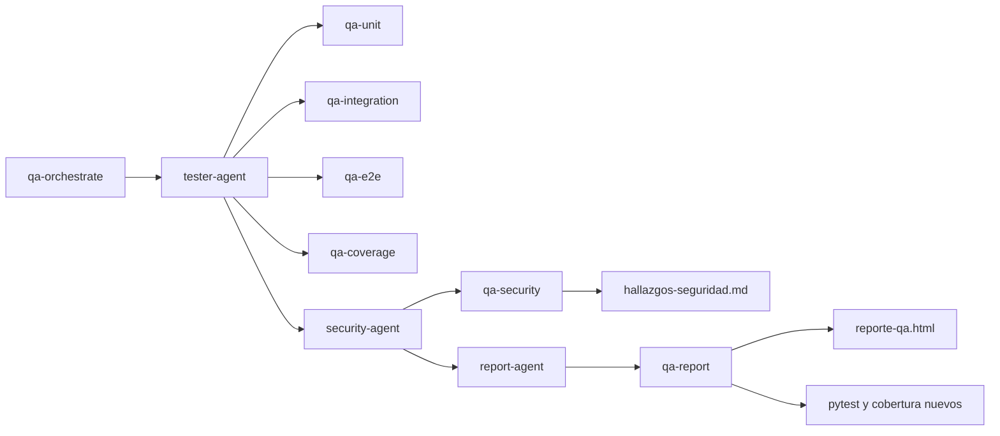

# Arquitectura QA de la práctica 4

Se continúa el conversor de P3, no otro sistema. Las siete skills son recetas
reutilizables y los tres agentes son roles declarados en archivos nativos de
agy, con `subagent: true`. En la configuración conservada de la guía no se
estableció una allowlist de herramientas por rol; las fronteras de responsabilidad
son instrucciones del prompt. El runtime actual requirió la adaptación dinámica
documentada en `compatibilidad-agy-1.2.0.md`; no se atribuye a todas las versiones
la ausencia de un campo `tools` que sí aparece en la documentación oficial actual.

`tester-agent` contrasta escenarios/FR con tests reales y distingue las tres
capas. `security-agent` revisa secretos, entradas y excepciones; aplica sólo
higiene de configuración y guarda los hallazgos. `report-agent` vuelve a correr
las pruebas y la cobertura para que el HTML describa el estado actual.
La orquestación define el orden y espera a cada agente. Security y Report no
intercambian mensajes directos; el informe vuelve a medir por su cuenta.

## Compuerta al terminar

El hook `Stop` ejecuta pytest. Con todas las pruebas aprobadas devuelve `{}`;
con fallo devuelve `decision=continue` y la razón. Así permite escribir una
corrección y evita concluir el turno en rojo. No es una garantía de ausencia de
bugs: sólo cubre los tests presentes.

La versión de laboratorio conserva cada ejecución en una carpeta fechada,
incluyendo exit code, decisión JSON y log. En un fallo también copia las
fuentes y pruebas con hashes para poder reproducir el estado previo al fix.
Esto conserva evidencia aunque el agente corrija inmediatamente.

## Ruta de la guía

Se usa la ruta corta recomendada: Setup → A (tester) → B (hook, bug y fix) → E
(orquestador con otro bug). Se omiten únicamente C/D como llamadas manuales:
`qa-orchestrate` ejecuta también `security-agent` y `report-agent`.

Las ejecuciones concretas y el cumplimiento se registran aparte; este archivo
explica la configuración y no convierte una receta en evidencia de ejecución.
