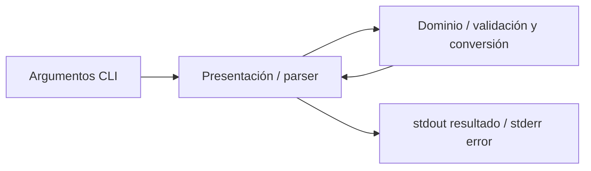

# Diseño y alcance P03–P04 — laboratorio

Actor: persona que convierte temperaturas mediante CLI. Objetivo: resultados
correctos entre C, F y K, errores legibles y pruebas trazables a la spec.
Nivel L. Datos sintéticos, cálculo local, sin persistencia, red, cuentas ni secretos.
No alcance: API HTTP, interfaz web del producto, pagos, SRI, datos personales,
servicios institucionales, carga, despliegue y repositorio remoto.

Python 3.12 es exigido por el curso y ya está disponible; stdlib Decimal evita
redondeo binario en los límites de temperatura. uv fija dependencias y ejecuta
el entorno. Se descarta FastAPI porque no existe requerimiento HTTP; no se
necesitan microservicios ni una base. No hay normativa de facturación ni
tratamiento de datos personales aplicable a los ejemplos sintéticos.

## Componentes y contrato

Los datos viven únicamente en memoria durante el proceso. La capa de datos
no se implementa porque no hay almacenamiento. No hay API REST ni autenticación.
Entrada: valor numérico + origen C/F/K + destino C/F/K.
Salida exit 0: `32.00 F`; error de uso/dominio exit 2 en stderr.
La spec detallada y sus FR gobiernan las pruebas P4; no se crea test-spec aparte.

## Verificación y reversibilidad

Mismos tres casos reales para versiones manual y Spec Kit. QA: unidad,
integración directa CLI→dominio en memoria y e2e mediante subprocess.
Hook Stop: una ejecución aislada con bug debe pedir continuar; versión corregida
debe producir `{}`. Segundo ángulo: proceso CLI y cálculo de referencia.
Las fases se conservan; no se elimina ni reemplaza material previo.
