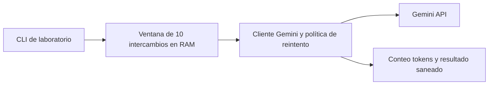

# Clase 2 APIs de IA Generativa y memoria conversacional

Laboratorio Python 3.12 con el modelo `gemini-2.5-flash`, de acuerdo con la guía. Código en inglés y mensajes didácticos en español. Se usa una identidad ficticia, no información personal.

## Reproducción

Definir `GEMINI_API_KEY` en el entorno o en `.env` ignorado por Git. Ejecutar desde esta carpeta:

```sh
uv sync
uv run python gemini_client.py
uv run python gemini_client.py --mode forgetting
uv run python gemini_client.py --mode temperature
uv run python conversation.py --json-output ../entregas/s02/evidencia/memoria-nueva.json
uv run python conversation.py --mode rate-limit
uv run pytest
```

## Requerimientos y arquitectura

RF1 llamada real con parámetros explícitos y conteo tokens. RF2 ocho turnos con recuerdo de nombre y color iniciales. RF3 memoria acotada. RF4 429 y 5xx con backoff 1, 2, 4 segundos; otros 4xx sin reintentos. RF5 fallo no duplica ni elimina turnos previos. Se comprueban con tests y logs del proveedor; la prueba automatizada por sí sola no acredita una llamada real.



Sin web, base de datos, despliegue ni datos reales. La credencial se lee del entorno. Python y uv son requisitos del curso; no se añaden frameworks de backend antes de necesitarlos.

## Por qué ventana deslizante

Diez intercambios conservan íntegros los ocho turnos exigidos y acotan memoria y contexto sin una llamada adicional para resumir. Frente a resumen progresivo evita costo y pérdida por resumen; frente a memoria selectiva o almacenamiento externo evita infraestructura innecesaria. En conversaciones más largas puede perder datos antiguos: no ofrece memoria permanente.

## Diferencias intencionales frente al ejemplo

La historia se confirma solamente tras una respuesta válida, así un fallo no duplica mensajes ni recorta datos previos. `thinking_budget=0` mantiene las respuestas de demostración dentro del presupuesto de salida y se registra expresamente. La generación conserva system instruction, temperatura y máximo de salida explícitos. El experimento de tasa hace hasta 20 solicitudes lógicas consecutivas de «Cuenta hasta…» con historial, como la guía, y se detiene al observar el primer 429 manejado; cada solicitud admite hasta tres reintentos. Si no ocurre, se informa sin inventar evidencia.

## Evidencia de ejecución

El 10 de septiembre de 2026 se ejecutó Gemini 2.5 Flash real. [Conversación completa](../entregas/s02/evidencia/memoria-20260910.txt): ocho turnos, último mensaje «Te llamas Alex y tu color favorito es el verde», historial de 16 entradas y salida 0. [Datos por turno](../entregas/s02/evidencia/memoria-20260910.json).

La [demostración sin historial](../entregas/s02/evidencia/olvido-y-temperatura-20260910.txt) no recordó Valeria en la segunda solicitud. El mismo archivo conserva las ejecuciones con temperaturas 0.1 y 1.3; dos muestras no prueban una diferencia estadística.

Se completaron dos ensayos acotados sin 429: [20 respuestas OK sin historial](../entregas/s02/evidencia/rate-limit-20260910.txt) y [20 solicitudes de conteo con historial siguiendo la guía](../entregas/s02/evidencia/rate-limit-guia-20260910.txt). Todas respondieron STOP. La guía presupone un límite del tier gratuito; el tier/cuota de la credencial no se verificó. No se atribuye el resultado a una causa no comprobada ni se aumenta carga sin límite.

La captura del 429 real queda pendiente. Los tests usan dobles explícitos para provocar ramas de error y verificar backoff 1, 2, 4, sin duplicar mensajes; no equivalen al 429 real solicitado.

La memoria correcta no valida cada explicación del modelo. El transcript original se preserva y sus errores sobre `int` y `uv init` se corrigen en [revisión técnica](../docs/p01/RESULTADOS.md).

## Conversación íntegra de ocho turnos

Registro original del proveedor, conservado literalmente. El indicador histórico MEMORY_RECALL_PASS era una coincidencia léxica; la revisión del turno 8 confirma en este caso el recuerdo. La versión corregida emite run_completed y lexical_match y exige revisión semántica del texto. El código de salida 0 acredita la ejecución completa, no la exactitud de cada respuesta.

```text
Run started UTC: 2026-09-11T00:48:30.209661+00:00
Source: actual Gemini API execution

REAL_PROVIDER model=gemini-2.5-flash time=2026-09-11T00:48:30.481263+00:00

TURNO 1 USER: En este ejemplo ficticio me llamo Alex y mi color favorito es el verde.
USAGE prompt=45 output=37 total_token_count=82 finish=FinishReason.STOP
TURNO 1 BOT: ¡Hola Alex! Es un gusto conocerte.

Como tu instructor de programación, te guiaré en este emocionante camino. ¡Me encanta que tu color favorito sea el verde!

TURNO 2 USER: ¿Qué es un framework de Python?
USAGE prompt=92 output=67 total_token_count=159 finish=FinishReason.STOP
TURNO 2 BOT: Un framework de Python es un conjunto de herramientas y librerías preestablecidas que facilitan el desarrollo de software. Proporciona una estructura base, ahorrándote tiempo y esfuerzo al no tener que escribir todo desde cero. Esto agiliza la creación de aplicaciones web, de escritorio, o cualquier otro tipo de proyecto.

TURNO 3 USER: Dame un ejemplo de dato que no cabe en un int.
USAGE prompt=173 output=49 total_token_count=222 finish=FinishReason.STOP
TURNO 3 BOT: Un ejemplo de dato que no cabe en un `int` es el número de granos de arena en todas las playas del mundo. Este número es tan inmenso que excede la capacidad de almacenamiento de un tipo `int` estándar.

TURNO 4 USER: ¿Qué hace el comando uv init?
USAGE prompt=232 output=64 total_token_count=296 finish=FinishReason.STOP
TURNO 4 BOT: El comando `uv init` **inicializa un nuevo entorno virtual** en tu proyecto. Crea un directorio (por defecto `.venv`) donde se instalarán las dependencias de tu proyecto, aislándolas de otras instalaciones de Python en tu sistema. Esto ayuda a mantener tus proyectos organizados y evitar conflictos de versiones.

TURNO 5 USER: Explica en una frase qué es un token.
USAGE prompt=308 output=25 total_token_count=333 finish=FinishReason.STOP
TURNO 5 BOT: Un token es la unidad más pequeña de significado en un programa, como una palabra clave, un operador o un identificador.

TURNO 6 USER: ¿Qué significa que una API sea stateless?
USAGE prompt=344 output=65 total_token_count=409 finish=FinishReason.STOP
TURNO 6 BOT: Que una API sea "stateless" significa que **cada solicitud del cliente a la API es independiente y contiene toda la información necesaria para ser procesada**, sin que el servidor guarde ningún tipo de información de sesiones anteriores. En otras palabras, el servidor no "recuerda" interacciones previas con el cliente.

TURNO 7 USER: ¿Para qué sirve un archivo .env?
USAGE prompt=420 output=63 total_token_count=483 finish=FinishReason.STOP
TURNO 7 BOT: Un archivo `.env` sirve para **almacenar variables de entorno** que tu aplicación necesita, como claves de API o credenciales de bases de datos. Su uso es crucial para mantener información sensible fuera del código fuente y facilitar la configuración de tu aplicación en diferentes entornos (desarrollo, producción, etc.).

TURNO 8 USER: ¿Cómo me llamo y cuál es mi color favorito?
USAGE prompt=497 output=11 total_token_count=508 finish=FinishReason.STOP
TURNO 8 BOT: Te llamas Alex y tu color favorito es el verde.
MEMORY_RECALL_PASS=True history_entries=16

Process exit: 0
```

La salida JSON se crea de forma exclusiva antes de llamar al proveedor. Una ruta existente o un directorio ausente se rechazan sin llamadas; un archivo reservado de un proceso interrumpido se preserva y debe elegirse otro nombre.
