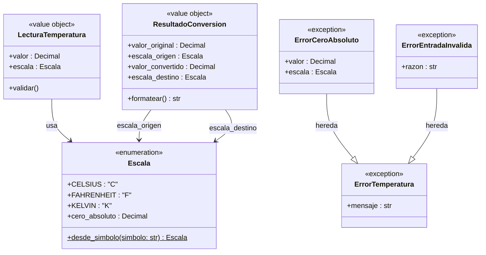

# Phase 1 Data Model: Conversor de Temperatura CLI

**Feature**: [spec.md](spec.md)
**Date**: 2026-09-10
**Status**: Completed

El presente modelo describe las entidades de dominio, tipos de valor, invariantes y reglas de validación necesarias para implementar el conversor de temperatura conforme a la especificación.

---

## 1. Diagrama de Entidades



---

## 2. Definición de Entidades

### 2.1 `Escala` (Enumeración)
Representa las unidades termométricas soportadas y sus constantes físicas universales.

- **Valores**:
  - `CELSIUS`: Símbolo `'C'`
  - `FAHRENHEIT`: Símbolo `'F'`
  - `KELVIN`: Símbolo `'K'`
- **Atributos de Clase / Propiedades**:
  - `cero_absoluto`: `Decimal`
    - `CELSIUS` → `Decimal('-273.15')`
    - `FAHRENHEIT` → `Decimal('-459.67')`
    - `KELVIN` → `Decimal('0.0')`
- **Operaciones**:
  - `desde_simbolo(simbolo: str) -> Escala`:
    - Normaliza la cadena de entrada eliminando espacios y convirtiendo a mayúsculas (`simbolo.strip().upper()`).
    - Retorna la instancia de `Escala` correspondiente.
    - Si el símbolo no es `'C'`, `'F'` ni `'K'`, lanza `ErrorEntradaInvalida(f"Unidad no soportada: '{simbolo}'. Se esperaba 'C', 'F' o 'K'.")`.

---

### 2.2 `LecturaTemperatura` (Value Object)
Modela un punto de medición térmico validado antes de ser transformado.

- **Campos**:
  - `valor`: `Decimal` — Magnitud numérica de la temperatura.
  - `escala`: `Escala` — Unidad en la que se expresa la magnitud.
- **Invariantes y Reglas de Validación**:
  1. **Finitud**: `valor.is_finite()` debe ser verdadero. Si es `NaN`, `+Infinity` o `-Infinity`, se rechaza con `ErrorEntradaInvalida`.
  2. **Límite de magnitud**: `abs(valor) <= Decimal('1e12')`. Si excede este rango, se rechaza con `ErrorEntradaInvalida`.
  3. **Límite termodinámico**: `valor >= escala.cero_absoluto`. Si `valor < escala.cero_absoluto`, se rechaza con `ErrorCeroAbsoluto(valor, escala)` señalando que no existen temperaturas bajo el cero absoluto en esa escala.
  4. **Valores negativos válidos**: Valores negativos donde `escala.cero_absoluto <= valor < 0` (e.g. `-40 C`, `-40 F`, `-273.15 C`) son completamente válidos y aceptados.

---

### 2.3 `ResultadoConversion` (Value Object)
Encapsula el valor transformado tras aplicar las fórmulas físicas de conversión.

- **Campos**:
  - `valor_original`: `Decimal`
  - `escala_origen`: `Escala`
  - `valor_convertido`: `Decimal`
  - `escala_destino`: `Escala`
- **Operaciones**:
  - `formatear() -> str`:
    - Aplica redondeo aritmético convencional a dos decimales:
      ```python
      cuantizado = self.valor_convertido.quantize(Decimal('0.01'), rounding=decimal.ROUND_HALF_UP)
      if cuantizado.is_zero():
          cuantizado = Decimal('0.00')
      return f"{cuantizado:.2f} {self.escala_destino.value}"
      ```
    - **Regla semántica de cero con signo**: Si y solo si `cuantizado.is_zero()` es verdadero (por ejemplo `-0.0001` redondeado a `-0.00`), se normaliza a `0.00`. Para cualquier otro valor no nulo (como `32.00`), se conserva el signo y valor exacto.

---

## 3. Fórmulas de Conversión de Dominio

Todas las operaciones se efectúan utilizando constantes `Decimal`:

| Par Origen ➔ Destino | Fórmula en Dominio Matemático |
|---|---|
| **C ➔ F** | $F = C \times \frac{9}{5} + 32$ |
| **F ➔ C** | $C = (F - 32) \times \frac{5}{9}$ |
| **C ➔ K** | $K = C + 273.15$ |
| **K ➔ C** | $C = K - 273.15$ |
| **F ➔ K** | $K = (F - 32) \times \frac{5}{9} + 273.15$ |
| **K ➔ F** | $F = (K - 273.15) \times \frac{9}{5} + 32$ |
| **Misma Escala (X ➔ X)** | $X_{dest} = X_{orig}$ (preservación de valor) |

---

## 4. Jerarquía de Excepciones

- **`ErrorTemperatura(Exception)`**: Clase base para anomalías de la biblioteca.
- **`ErrorCeroAbsoluto(ErrorTemperatura)`**: Lanzada cuando la lectura viola el cero absoluto de la escala origen.
- **`ErrorEntradaInvalida(ErrorTemperatura)`**: Lanzada ante cadenas vacías, longitud > 32 caracteres, formatos alfanuméricos no numéricos, literales `nan`/`inf`, unidades desconocidas o magnitudes superiores a $1.0 \times 10^{12}$.
